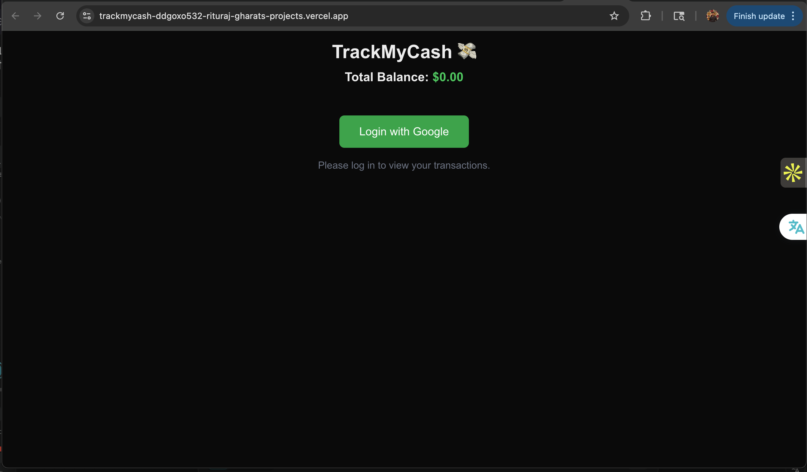
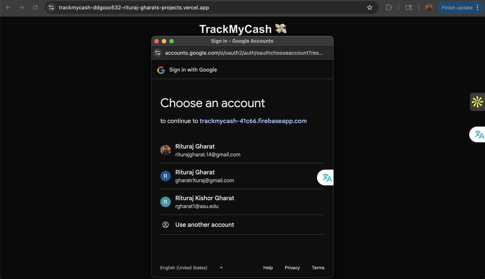
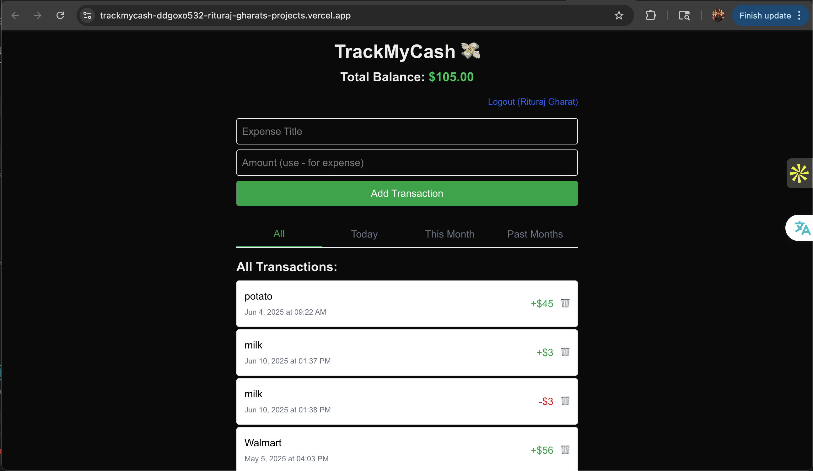
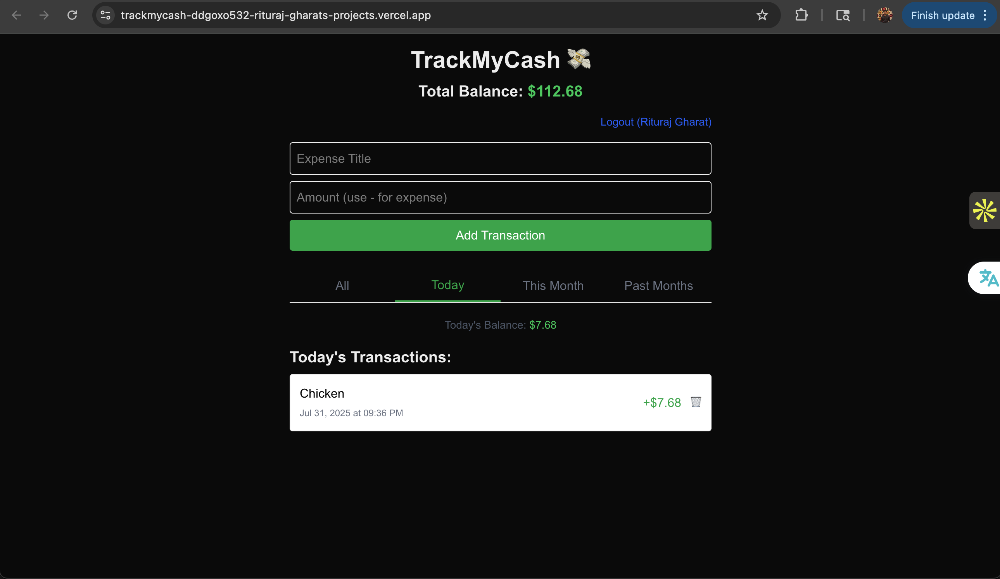
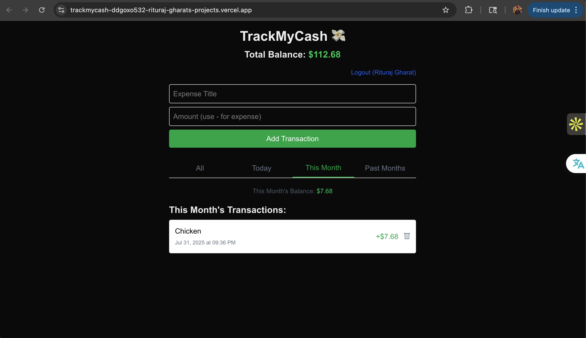
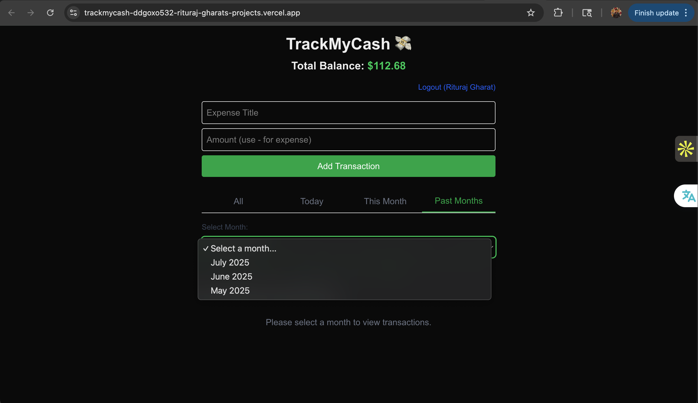
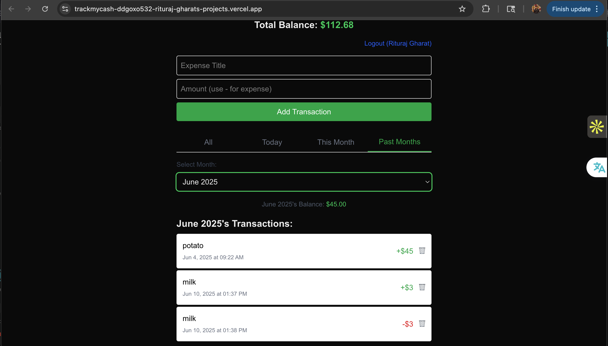

```TrackMyCash 💸```

🚀 Live Demo

Visit the live application: [TrackMyCash](https://trackmycash-ddgoxo532-rituraj-gharats-projects.vercel.app/)
```
TrackMyCash is a sleek, intuitive expense tracker built with Next.js, Firebase, and TypeScript. Effortlessly monitor
your daily, monthly, and long-term spending trends with a clean interface and real-time updates.
```

🖥️ Screenshots
<p align="center">
  
   
  
</p>

<p align="center">
  
   
  
</p>

<p align="center">
  
   
  

  
</p>


```
🌟 Features

🔐 Authentication
- Google Sign-In: Secure authentication using Firebase Auth
- User-Specific Data: Each user sees only their own transactions
- Persistent Login: Stay logged in across browser sessions

💰 Transaction Management
- Add Transactions: Easy form to add income and expenses
- Real-time Updates: Instant updates across all views
- Delete Transactions: Remove unwanted entries with one click
- Amount Formatting: Automatic currency formatting with +/- indicators

📊 Multiple View Modes
- All Transactions: Complete transaction history
- Today's View: See only today's spending and income
- This Month: Current month's financial overview
- Past Months: Historical analysis with month picker

🎨 Modern UI/UX
- Responsive Design: Works perfectly on desktop and mobile
- Dark Theme: Easy on the eyes with modern styling
- Intuitive Navigation: Tab-based interface for easy switching
- Visual Feedback: Color-coded amounts (green for income, red for expenses)
```

🛠️ Tech Stack

- Frontend: Next.js 14, React 18, TypeScript
- Styling: Tailwind CSS
- Backend: Firebase Firestore
- Authentication: Firebase Auth
- Deployment: Vercel

📦 Installation

Prerequisites
- Node.js 18+ 
- npm or yarn
- Firebase project
```

Setup Instructions

1. Clone the repository
2. git clone https://github.com/rituraj-gharat/trackmycash.git
   cd trackmycash
   ```

3. Install dependencies
4. ```bash
   npm install
   ```

5. Set up Firebase
   - Create a new Firebase project at [Firebase Console](https://console.firebase.google.com/)
   - Enable Authentication with Google Sign-in
   - Create a Firestore database
   - Get your Firebase config

6. Configure environment variables
   Create a `.env.local` file in the root directory:
   ```env
   NEXT_PUBLIC_FIREBASE_API_KEY=your_api_key
   NEXT_PUBLIC_FIREBASE_AUTH_DOMAIN=your_auth_domain
   NEXT_PUBLIC_FIREBASE_PROJECT_ID=your_project_id
   NEXT_PUBLIC_FIREBASE_STORAGE_BUCKET=your_storage_bucket
   NEXT_PUBLIC_FIREBASE_MESSAGING_SENDER_ID=your_sender_id
   NEXT_PUBLIC_FIREBASE_APP_ID=your_app_id
   ```

7. Update Firebase configuration
   Edit `lib/firebase.js` with your Firebase config:
   ```javascript
   const firebaseConfig = {
     apiKey: process.env.NEXT_PUBLIC_FIREBASE_API_KEY,
     authDomain: process.env.NEXT_PUBLIC_FIREBASE_AUTH_DOMAIN,
     projectId: process.env.NEXT_PUBLIC_FIREBASE_PROJECT_ID,
     storageBucket: process.env.NEXT_PUBLIC_FIREBASE_STORAGE_BUCKET,
     messagingSenderId: process.env.NEXT_PUBLIC_FIREBASE_MESSAGING_SENDER_ID,
     appId: process.env.NEXT_PUBLIC_FIREBASE_APP_ID
   };
   ```

8. Run the development server
   ```bash
   npm run dev
   ```

9. Open your browser
   Navigate to [http://localhost:3000](http://localhost:3000)

📱 Usage Guide

Getting Started
1. Sign In: Click "Login with Google" to authenticate
2. Add Transactions: Use the form to add income (+) or expenses (-)
3. Navigate Views: Switch between All, Today, This Month, and Past Months tabs

Adding Transactions
- Title: Enter a descriptive name (e.g., "Groceries", "Salary")
- Amount: Use positive numbers for income, negative for expenses
- Submit: Click "Add Transaction" to save

Viewing Your Data
- All: Complete transaction history
- Today: Only today's transactions
- This Month: Current month's overview
- Past Months: Select any historical month from the dropdown

Managing Transactions
- Delete: Click the trash icon (🗑) to remove transactions
- View Details: See date, time, and amount for each transaction

🏛️ Project Structure

```
trackmycash/
├── src/
│   └── app/
│       ├── page.tsx          # Main application component
│       ├── layout.tsx        # Root layout
│       └── globals.css       # Global styles
├── lib/
│   └── firebase.js          # Firebase configuration
├── public/                  # Static assets
└── package.json
```

🔧 Key Components

Authentication System
- Google Sign-in integration
- User session management
- Secure data isolation

Transaction Management
- Real-time CRUD operations
- Automatic balance calculation
- Date-based filtering

UI Components
- Tab navigation system
- Responsive transaction cards
- Dynamic month picker
- Loading states and error handling

💡 Features in Detail

Smart Filtering
- *Daily Filter*: Shows transactions from today only
- *Monthly Filter*: Shows current month's transactions
- *Historical Filter*: Browse any past month with transactions
- *Dynamic Balance*: Real-time balance calculation for each view

Data Organization
- *Chronological Sorting*: Newest transactions first
- *Category-Free*: Simple title-based organization
- *Amount Tracking*: Positive/negative amount indicators
- *Timestamp Recording*: Automatic date and time stamps

User Experience
- *Intuitive Interface*: Clean, modern design
- *Responsive Layout*: Works on all device sizes
- *Fast Performance*: Optimized for quick interactions
- *Error Handling*: Graceful error states and messages

🚀 Deployment

Vercel (Recommended)
1. Connect your GitHub repository to Vercel
2. Add environment variables in Vercel dashboard
3. Deploy automatically on push to main branch

Manual Deployment
```bash
npm run build
npm start
```

🤝 Contributing

1. Fork the repository
2. Create a feature branch (`git checkout -b feature/AmazingFeature`)
3. Commit your changes (`git commit -m 'Add some AmazingFeature'`)
4. Push to the branch (`git push origin feature/AmazingFeature`)
5. Open a Pull Request

📄 License

This project is licensed under the MIT License - see the [LICENSE](LICENSE) file for details.

👨‍💻 Author

*Rituraj Gharat*
- Linkedin: [Rituraj Gharat](https://www.linkedin.com/in/riturajgharat/)
- GitHub: [@rituraj-gharat](https://github.com/rituraj-gharat)
- Project: [TrackMyCash](https://github.com/rituraj-gharat/trackmycash)

📢 Acknowledgments

- Built with [Next.js](https://nextjs.org/)
- Styled with [Tailwind CSS](https://tailwindcss.com/)
- Powered by [Firebase](https://firebase.google.com/)
- Deployed on [Vercel](https://vercel.com/)

---

⭐ *Star this repository if you found it helpful!*
